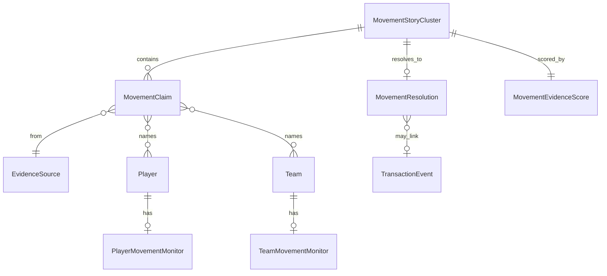

# Movement Center architecture

**Permanent product name:** Movement Center  
**Seasonal presentation:** Rumor Mill (configurable — not the system name)

Types: `src/movement-center/types.ts`  
Prominence config: `src/movement-center/prominence.ts`  
UI shell: `src/components/players/player-movement-center-column.tsx`

---

## Distinction from transactions

| System | Question | Data | Visual treatment |
| --- | --- | --- | --- |
| **Offseason / transactions** | What actually happened? | ESPN archive, future structured ledger | Official / REAL / source-text labels |
| **Movement Center** | What may happen? What is being reported? | Curated claims + clusters | Reported / Rumored / Speculative — never identical to completed deals |

A completed transaction must link to a **resolution** on a movement cluster, not replace it in place.

Existing `TransactionEvent.status = "reported"` in `src/offseason` classifies **offseason ingest semantics**, not Movement Center evidence class. Do not merge the enums without an explicit migration.

---

## Evidence classes (visible)

| Class | Definition | UI |
| --- | --- | --- |
| **Reported** | Credible reporter/outlet directly names player, team, agent, or negotiation | Strong label, source chain required |
| **Rumored** | Multiple independent credible reports connect entities; less direct | Medium label, cluster view |
| **Speculative** | Analyst/community hypothesis without credible direct reporting | Muted label, hard score cap |

### Factual states (orthogonal)

`official` · `completed` · `denied` · `retracted` · `expired` · `unresolved`

**Reported ≠ confirmed.**

---

## Movement Monitor (player / team)

Example monitor card:

- Rumor activity: High / Moderate / Low
- Teams linked: BOS, LAL, MIA
- Direction: Rising / Stable / Falling
- Last meaningful report: timestamp
- Evidence strength: 78/100 (**not** P(trade))

Detail view answers: **Why is this player being discussed?**

### Evidence timeline (per cluster)

Each row:

- Date/time (UTC + local display)
- Claim summary
- Claim type (`trade_interest`, `extension_talks`, …)
- Original source + reporter/outlet
- Entities named (player/team ids)
- Evidence class
- Original vs derivative (`MovementProvenanceKind`)
- Cluster id
- Corrections, denials, retractions
- Resolution outcome (if known)

---

## Evidence strength score (0–100)

Represents **strength of available evidence**, not probability of movement.

### Components (stored for explainability)

| Component | Role |
| --- | --- |
| `sourceCredibility` | Tiered outlet/reporter prior (curated table) |
| `reportDirectness` | Named entities vs vague “teams have interest” |
| `independentCorroboration` | Distinct original reports (see penalties) |
| `recency` | Time decay |
| `entitySpecificity` | Player + team both named |
| `negotiationSpecificity` | Contact / offer / active talks explicitly stated |
| `hypotheticalPenalty` | Cap for speculative / trade-machine posts |
| `repetitionPenalty` | Aggregators repeating one original |
| `denialCounterevidence` | Surfaces counterevidence; does not auto-nullify |

### Initial weight proposal (M0 tuning)

| Factor | Weight cap | Notes |
| --- | --- | --- |
| Source credibility | 0–35 | Tier 1 national insiders highest; unknown blogs floor |
| Directness | 0–20 | |
| Independent corroboration | 0–20 | Max +5 per **original** report; max 3 originals count |
| Recency | 0–15 | Half-life ~72h in-season; ~7d offseason |
| Entity specificity | 0–10 | |
| Negotiation specificity | 0–10 | |

**Penalties:**

- Repost of same `citesClaimId`: 0 corroboration credit
- Aggregator-only chain: −10 repetition penalty
- Speculative class: hard cap total at 25
- Denial from named team: −8 counterevidence (visible, not hidden)
- Story inactive >30 days: recency → 0; cluster may `expire`

`methodologyVersion` required on every score.

---

## Ingestion pipeline (intended — not built)

```text
Permitted source ingestion
  → document normalization
  → entity resolution (player/team ids — reuse identity layer)
  → claim extraction (NLP + human QA in M1)
  → original-source tracing
  → duplicate detection
  → story clustering
  → evidence class assignment
  → rumor state
  → player/team movement timeline
  → outcome resolution (Rumor → Reality)
```

### Source policy (M0 requirement)

**Permitted (evaluate per contract):**

- Licensed publisher RSS/API
- Official team/league statements
- Manually curated reporter list with attribution metadata

**Explicitly not M0:**

- Twitter/X scraping without permitted API access and retention policy
- Full-firehose social listening
- User-generated content as movement evidence (speculative class only, separate ingest)

**Architecture constraints:** ToS, copyright, quotation limits, retention, right to be forgotten for erroneous clusters.

---

## Story clustering & provenance

`MovementProvenanceKind` distinguishes:

- `original_report`
- `cites_report`
- `aggregation`
- `commentary`
- `hypothetical_analysis`
- `community_speculation`
- `official_statement`
- `completed_transaction`

Clusters share `MovementStoryCluster`; claims link via `clusterId` and `citesClaimId`.

---

## Rumor → Reality

| Outcome | Meaning |
| --- | --- |
| `materialized` | Reported move occurred within window |
| `partially_materialized` | Related but not exact (e.g. different team) |
| `did_not_materialize` | Window closed with no related transaction |
| `contradicted` | Official denial + no later materialization |
| `retracted` | Source retraction |
| `expired` | Age/window elapsed |
| `still_unresolved` | Active |
| `unable_to_determine` | Insufficient resolution data |

**Nuanced rule:** “Team A discussed Player X” is not falsified solely because no trade happened.

### Resolution windows (configurable)

| Window type | Typical duration |
| --- | --- |
| Trade deadline rumor | Through deadline + 48h |
| Offseason FA | Through moratorium + signing period |
| Extension | Through reported deadline or season start |
| Trade request | Through trade or season end |
| Front office | Through hire announcement + 30d |

### Source reliability (M4+)

No crude “accuracy %” without:

- Sample size floors
- Claim-type stratification
- Resolution window alignment
- Original vs derivative credit
- Partial outcome handling

---

## Seasonal prominence (configuration-driven)

`resolveMovementPresentation()` in `src/movement-center/prominence.ts` is a **stub** — production uses an NBA event calendar table.

| Mode | Nav prominence | Rumor Mill label |
| --- | --- | --- |
| Offseason | Featured | “Where the league might move next” |
| Early regular | Discovery | Movement Center (background) |
| Pre-deadline | Standard | “What might move before the deadline?” |
| Deadline week | Featured | “Rumor Mill — Trade Deadline Mode” |
| Post-deadline | Discovery | Collapsed |
| Quiet | Discovery | Small module |

---

## Ask DRBL integration (M5)

Supported question shapes:

- Why is this player being discussed?
- Which teams are credibly linked?
- What is the original source?
- Independent reports or repetitions?
- What changed in the last 24 hours?
- Similar rumors that later materialized?

Answer contract:

- Cite underlying claims
- Show provenance chain
- Explain evidence score components
- Separate fact / report / inference / speculation
- State uncertainty
- **Never** assert unresolved rumor as truth

---

## Entity relationships



---

## Implementation phases

### M0 — Architecture & source policy ← **current**

- [x] Domain types (`src/movement-center/`)
- [x] Product docs + roadmap placement
- [x] Player overview column shell (empty state only)
- [ ] Legal/licensing review checklist
- [ ] Evidence score spec sign-off
- [ ] Source tier table (curated)

**Acceptance:** No ingest; no fake scores in production; transactions remain separate.

### M1 — Curated internal prototype

- Manual source set (3–5 outlets)
- Entity resolution against `player-identity-cache`
- Clustering + timeline internal UI
- Human evaluation set (50 claims)

### M2 — Read-only product surface

- Movement Center landing
- Player/team monitors with real clusters
- Filters by evidence class
- Explainable score breakdown

### M3 — Seasonal mode

- Event calendar config
- Homepage/nav prominence rules
- Deadline live-market layout

### M4 — Rumor → Reality

- Outcome linking to `/offseason` REAL events
- Historical resolution database
- Source methodology (not vanity accuracy %)

### M5 — Ask DRBL + genealogy

- Citation retrieval
- Trade tree cross-links where materialized

---

## Dependencies

| Dependency | Blocks |
| --- | --- |
| Core UX / perf consolidation | M1+ public surfaces |
| Player/team identity resolution | Claim entity linking |
| Structured transaction ledger (optional) | Clean Rumor → Reality |
| Source licensing | Any automated ingest |

---

## Non-goals

- Scraping X/Twitter without permitted API
- Presenting evidence score as trade odds
- Mixing movement score into player value metrics
- Auto-publishing unreviewed claims in M1
