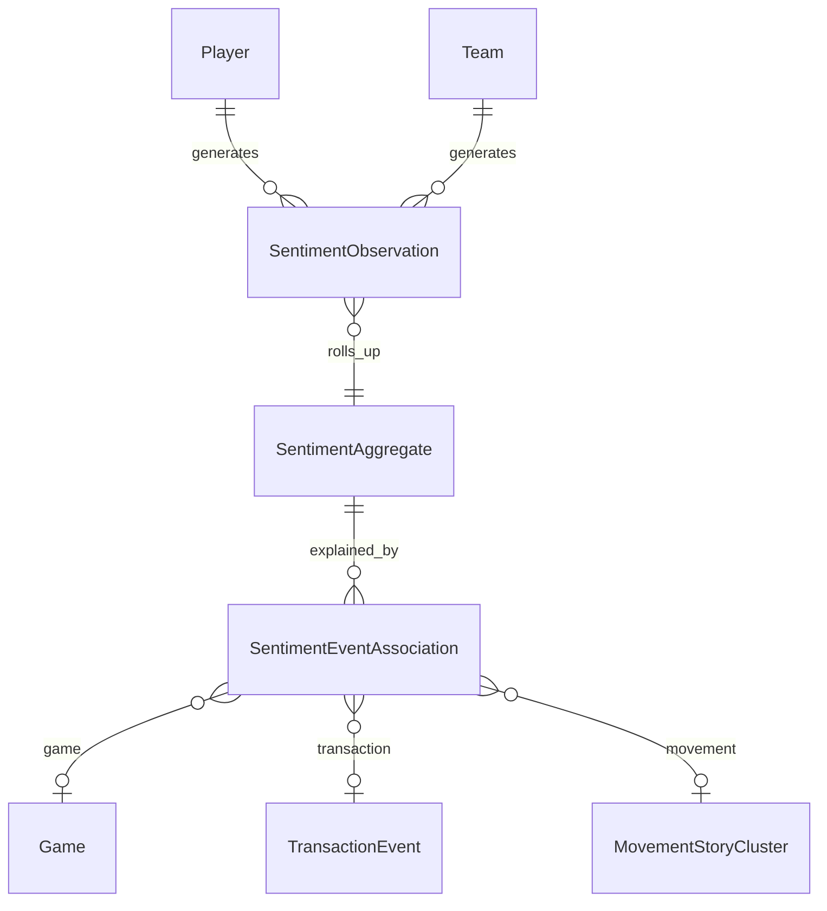

# Fan & Media Sentiment architecture

**Product name:** Sentiment (tab on Player and Team destinations)

Types: `src/sentiment/types.ts`

Sentiment measures **perception**, not performance or movement probability.

---

## Separation of domains

A player may simultaneously have:

| Signal | Example |
| --- | --- |
| Strong performance | Top percentile TS% |
| Falling fan sentiment | Post–trade request discussion |
| Positive media sentiment | National praise after playoff series |
| High movement activity | Multiple reported teams linked |

All four can be true. No composite “universal rating.”

---

## Required dimensions

| Dimension | Description |
| --- | --- |
| Overall sentiment | Weighted aggregate with coverage gate |
| Fan sentiment | `sourceClass: fan` |
| Media sentiment | `sourceClass: media` |
| Direction | rising / stable / falling |
| Change | vs prior window (24h, 7d, 30d, season) |
| Mention volume | Raw count + normalized rate |
| Coverage / confidence | 0–1; hide score if below floor |
| Platform breakdown | Reddit, news, YouTube, X (if permitted), … |
| Topic / aspect breakdown | Contract, role, injury, off-court, … |
| Event-linked changes | Associative explanations only |

---

## Data principles

Every aggregate stores:

- Sentiment value
- `coverageConfidence`
- `mentionVolume`
- `sourceClass`
- `platform`
- Timestamp / window
- Entity id
- Topic tags
- `modelVersion`
- `samplingMethod`

**A number without volume and coverage is not trustworthy** — UI must refuse to show it.

### Fan vs media

Separate pipelines and UI lanes:

| | Fan | Media |
| --- | --- | --- |
| Population | Community platforms | Outlets, beat writers |
| Bias | Homogeneity, brigading, memes | Outlet balance, narrative framing |
| Language | Slang, sarcasm | Headline tone |

---

## Source categories (feasibility)

| Platform | Phase | Notes |
| --- | --- | --- |
| Reddit | S1 candidate | API terms; subreddit sampling policy |
| News / sports media | S1 candidate | Licensed feeds preferred |
| YouTube | S2+ | Caption/transcript permissions |
| **X (Twitter)** | S0 research only | **No scraping in DRBL without permitted API**, attribution, retention policy, and cost model. Speculative notes from user request — architecture constraint, not implementation. |

---

## Event association (“What changed?”)

`SentimentEventAssociation` links sentiment deltas to events:

- Games, injuries, transactions, contracts
- Movement Center clusters (correlation only)
- Public comments, role changes, awards, playoffs

**Wording rules:**

- ✅ “Sentiment fell in the 48h window **associated with** the trade report”
- ❌ “The trade report **caused** sentiment to fall”

Connect to existing entities:

- `Game.id`
- `TransactionEvent.id` (offseason)
- `MovementStoryCluster.id`
- Injury/lineup events (future)

---

## Quality & safety

| Challenge | Mitigation |
| --- | --- |
| Sarcasm / NBA slang | Model version + human eval set |
| Player name ambiguity | Entity resolution + disambiguation confidence |
| Team abbreviation collisions | Canonical team ids |
| Spam / bots | Volume anomalies, account-age filters (platform permitting) |
| Brigading | Rate limits, subreddit weighting |
| Small samples | Minimum mention floor → “insufficient coverage” |
| Platform demographic bias | Disclose population in UI |
| Deleted content | Tombstone + coverage adjustment |
| Model drift | `modelVersion` on every aggregate; no cross-version charts without bridge |

---

## Time Machine integration (S4)

Historical sentiment timelines must account for:

- Changing platform coverage (e.g. Reddit exists; X access may not)
- Model version changes (annotated breaks on charts)
- Fan/media divergence overlays
- Comparison with performance (dual axis, no merged score)

---

## Ask DRBL integration (S4)

Example questions:

- Why has sentiment toward this player fallen?
- Are fans and media reacting differently?
- Did sentiment change after the trade report?
- Perception vs performance divergence?
- Topics driving negative discussion?

Answer contract:

- Cite aggregated evidence + sample sizes
- State platform coverage and window
- Clarify association vs causation
- Separate fan vs media when both exist

---

## Entity relationships

**No edge** from `SentimentAggregate` to DRBL impact or Movement evidence score.

---

## Implementation phases

### S0 — Research & source policy

- Platform feasibility (incl. X API vs omit)
- Sampling rules + taxonomy
- Baseline model evaluation
- Bias / uncertainty framework

**Acceptance:** Written policy; no production tab.

### S1 — Internal prototype

- 10–20 players, all teams optional
- Fan/media separation
- Topic classifier v0
- Human eval set (500 labeled mentions)

### S2 — Product tab

- Player/team Sentiment tab
- Trend charts + window controls
- Source breakdown + uncertainty UI

### S3 — Event association

- Game/transaction/movement linking
- “What changed?” copy templates (associative)

### S4 — Time Machine + Ask DRBL

- Historical timelines
- Performance vs perception views
- Citation-aware NL answers

---

## Dependencies

| Dependency | Notes |
| --- | --- |
| Movement Center M2+ | Movement-linked associations (S3) |
| Core player/team destinations | Tab scaffold |
| Platform licensing | Blocks automated ingest |

**Scheduled after Movement Center M2** (read-only monitors) at earliest.

---

## Non-goals

- Single unexplained “72% positive” badge
- Scraping X without permitted access
- Sentiment blended into player rankings or DRBL
- Presenting social volume as representative of all fans

---

## Risks

| Risk | Mitigation |
| --- | --- |
| Licensing / ToS | S0 legal review per platform |
| Misinformation amplification | Volume-weighted, not viral-weighted |
| Harassment / toxicity | Moderation queue; no raw slur display |
| Cost at scale | Sampled ingest + batch aggregates |
| Interpretation harm | Uncertainty UI; no causal claims |
