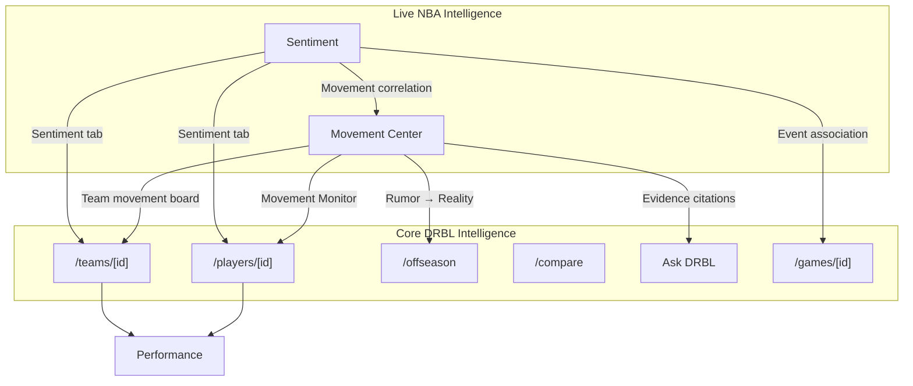

# Live NBA Intelligence

DRBL’s product surface splits into two layers that must never contaminate each other’s scores.

## Core DRBL Intelligence (shipping / in progress)

| Area | Routes / modules | Measures |
| --- | --- | --- |
| Player intelligence | `/players/[playerId]` | On-court performance, career, percentiles |
| Team intelligence | `/teams/[teamId]` | Board traits, roster, games, cap (partial) |
| Game intelligence | `/games/[gameId]`, Game Lab | Box score, flow, evidence |
| Contracts & transactions | `/offseason`, team payroll | **What actually happened** (REAL / source-text) |
| Compare | `/compare`, season-compare | Performance deltas |
| Ask DRBL | query engine | Citation-aware answers over supported metrics |
| Time Machine | history URLs, era themes | Historical season context |
| Play-by-play | `src/pbp/` stubs | Event corpus (not attached) |
| DRBL / WAR1 | learn, precomputed overlays | Impact methodology |

## Live NBA Intelligence (future — after core consolidation)

| System | Permanent name | Seasonal presentation | Measures |
| --- | --- | --- | --- |
| Movement Center | **Movement Center** | **Rumor Mill** (configurable) | Strength of reporting around possible movement |
| Sentiment | **Sentiment** | Sentiment tab | Fan vs media perception |

**Rule:** Performance ≠ rumor evidence ≠ sentiment. Ask DRBL may retrieve and compare all three, but storage, scoring, and UI must stay independent.

---

## Integration map (destinations)

### Player destination (`/players/[playerId]`)

| Section | Layer | Status |
| --- | --- | --- |
| Overview identity + percentiles | Core | Shipped |
| Contract + upcoming games (left column) | Core | Shipped |
| **Movement Center column** | Live | **Shell only** — `PlayerMovementCenterColumn` empty state |
| Sentiment tab | Live | Not started (Phase S2) |
| Transaction history on overview | Removed | Official history via `/offseason` |

### Team destination (`/teams/[teamId]`)

| Section | Layer | Status |
| --- | --- | --- |
| Organization → cap & assets | Core | Shipped (live roster + payroll) |
| Transactions strip | Core | ESPN archive (REAL events) |
| Movement Monitor | Live | Phase M2 |
| Sentiment tab | Live | Phase S2 |

### Offseason (`/offseason`)

| Content | Layer |
| --- | --- |
| ESPN transaction **events** | Core — what was recorded |
| Movement stories (unresolved) | Live — must never look like completed deals |

---

## Roadmap placement

Both systems are scheduled **after** the current UX / performance / merge-safety / data-quality consolidation and **before** play-by-play becomes the sole development focus.

**Order:** Movement Center (M0→M5) **then** Sentiment (S0→S4).

See:

- `docs/PRODUCT_ROADMAP.md` § Phase 9–10
- `docs/architecture/movement-center.md`
- `docs/architecture/sentiment.md`

---

## Non-goals (this phase)

- No Twitter/X scraper, unofficial social ingest, or production rumor feed
- No sentiment model training or public Sentiment tab
- No evidence scores presented as trade probability
- No blending movement score into DRBL / CPI / percentiles

---

## Open product questions

1. Which licensed publisher feeds are in scope for M1 (Shams/Woj tier vs long-tail)?
2. Is Movement Center player-column empty state sufficient until M2, or hide column until first curated cluster?
3. Sentiment: Reddit-only S1 vs news-only S1?
4. X/Twitter: API licensing budget vs omit platform entirely in v1?

---

## Risks (summary)

| Risk | Mitigation |
| --- | --- |
| Copyright / quotation limits | Source policy + attribution UI in M0 |
| Misinformation | Evidence classes + unresolved states + no probability claims |
| Derivative-report inflation | Story clustering + repetition penalties |
| Sentiment bias / bots | Volume + coverage gates; fan/media separation |
| Cost | Curated M1 before scale; no SSR social pulls |
| Moderation | Human review queue in M1 internal prototype |
